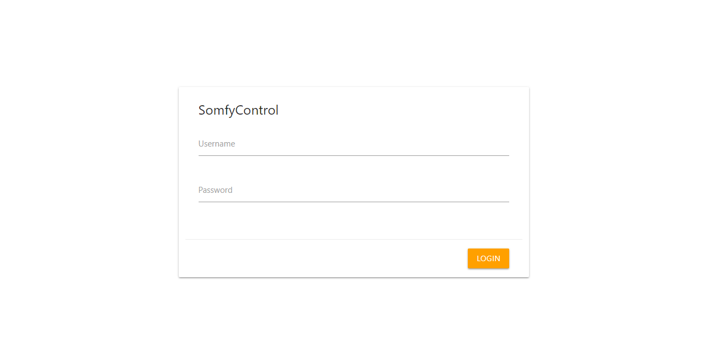
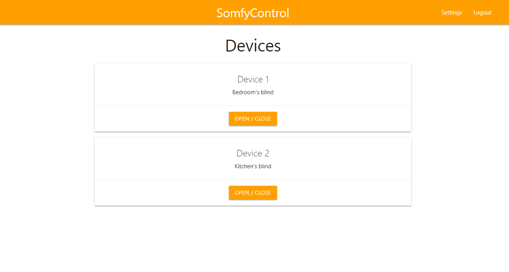
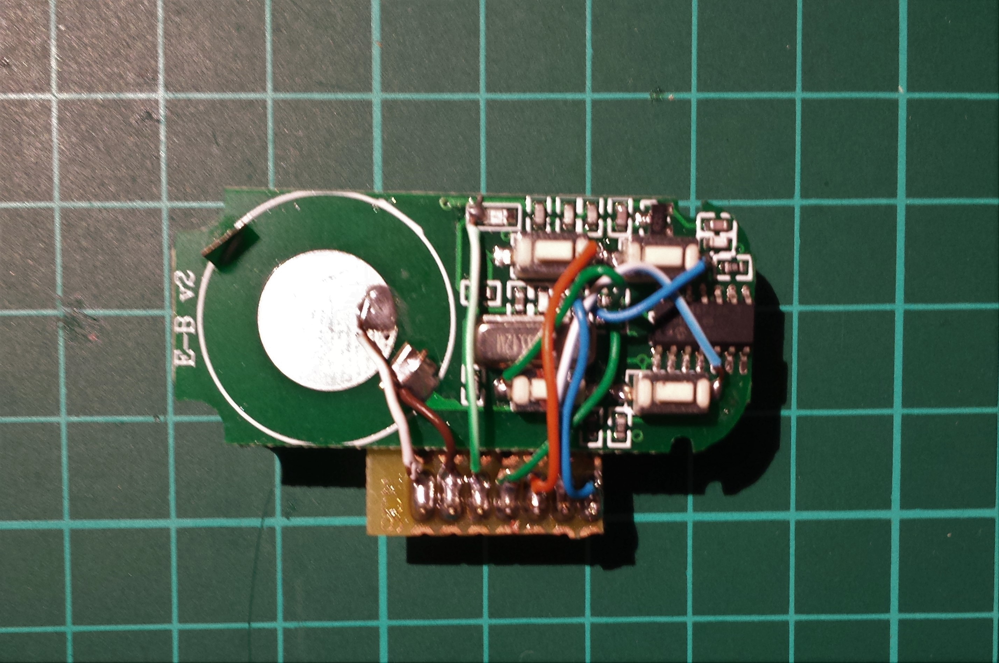
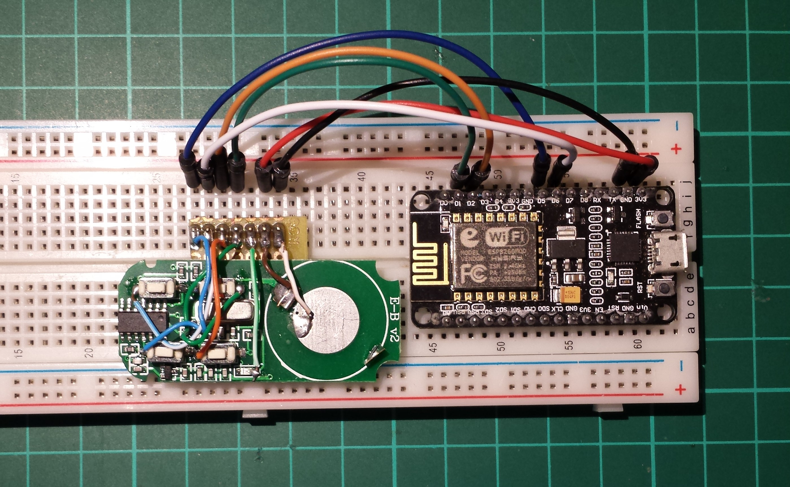

# SomfyControl for ESP8266

## Introduction
SomfyRemote allows you to control Somfy blinds using a simple web interface. The entire system is built around an ESP8266 microcontroller and a cheap compatible 433.42 MHz remote like [this](https://www.ebay.com/itm/SOMFY-KEYGO-4-RTS-compatible-remote-control-replacement-433-42Mhz/182202217810?hash=item2a6c193552:g:1QYAAOSw5cNYEy14). The remote has been hacked to be powered and controlled by the microcontroller.






## Features
- Web UI
- Login protection (see [here](#security-issues))
- Alexa support
- More coming...

## Requirements
- ESP8266 based development board
- 433.42MHz remote like [this](https://www.ebay.com/itm/SOMFY-KEYGO-4-RTS-compatible-remote-control-replacement-433-42Mhz/182202217810?hash=item2a6c193552:g:1QYAAOSw5cNYEy14)
- Wires, breadboard and stuff like that (depending on your needs)

## Setup
### Hardware
As mentioned above, I have hacked a 433.42MHz replacement remote compatible with the Somfy protocol in order to be easily controlled by the ESP8266 board. To program the remote just follow the instructions that comes with it.


The wiring is the following: 
- +3V: __3V3__
- GND: __GND__ 
- button 1: __GPIO 5__
- button 2: __GPIO 4__
- button 3: __GPIO 12__
- button 4: __GPIO 12__




### Software
In [config.json](SomfyControl/data/config.json) you will need to set your own preferences. The Sinric API key is mandatory only if you make use of the Alexa support. For more informations about the Alexa support take a look at [here](https://github.com/kakopappa/sinric).

```
{
    "ssid": "YOUR_WIFI_SSID",
    "password": "YOUR_WIFI_PASSWORD",
    "web_username": "admin",
    "web_password": "password",
    "sinric_enabled": false,
    "sinric_api_key": "YOUR_SINRIC_API_KEY",
    "language": "en",
    "languages": {
        "en": "English",
        "it": "Italiano",
        "fr": "Française"
    }
}
```
The [devices.json](SomfyControl/data/devices.json) file defines all the devices you want to control. The __button__ parameter defines the button on the remote you want to be pressed in order to control a specific device.
```
{
    "devices": [
        {
            "button": 1,
            "name": "Device 1",
            "description": "Bedroom's blind"
        },
        {
            "button": 2,
            "name": "Device 2",
            "description": "Kitchen's blind"
        }
    ]
}
```
Now you have to upload these two JSON file to the SPIFFS memory of the ESP8266. In order to do so, you have to install [this](https://github.com/esp8266/arduino-esp8266fs-plugin) plugin for the Arduino IDE, which allows you to upload the files inside the [data](SomfyControl/data) folder. Follow the plugin's repo instruction and then upload the data.

Now it's time to upload the firmware itself and for doing so you have just to open SomfyControl sketch with the Arduino IDE and then do the usual stuff. Open the serial monitor and you will see the boot process. If all goes well, the board will connect to the WiFi network and then you can use the web UI with your browser. __IMPORTANT: You should manually reset the board by pressing the RST button the first time you flash it in order to avoid [this](https://github.com/esp8266/Arduino/issues/1722) bug.__

<a name="security-issues"></a>
## Security issues
The login protection isn't very secure because the ESP8266 isn't powerfull enough to handle HTTPS connections and the session cookie is unique for every user. This is a __huge vulnerability__ because anyone can sniff the connection between you and the board, grabbing the cookie and logging in without needing to know the username and password. I will do my best to improve the security, but until then __be very carefull exposing the board on the open internet and even on your home network__.

## Disclaimer
This project is still in heavy development stage, so I cannot guarantee it's fully working.

## License
This project is licensed under the MIT License - see the [LICENSE.md](LICENSE.md) file for details